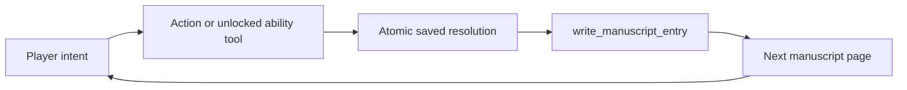

# The Last Manuscript

> **A six-turn mystery that ChatGPT and a living manuscript can only play together.**
> You choose. The page rolls and preserves the truth. ChatGPT writes what happens.

A 5–8 minute solo dark-fantasy mystery built for the
[OpenAI WebMCP Challenge](https://openai.com/webmcp-challenge/).

<!--
Submission media — keep hidden until every destination exists:
- Hero: docs/assets/hero.webp, ideally 1600×900. Show the ChatGPT conversation,
  the open manuscript, and a visible D20 result in one frame.
- Live app: add a "Play the live demo" link beside the demo video.
- Demo video: add a public, narrated video under three minutes.
Do not render links or a hero image until the real assets exist.
-->

The player speaks naturally in ChatGPT. The live page owns the rules, D20
rolls, inventory, clues, abilities, and endings. ChatGPT interprets the
player's intent through WebMCP and turns each saved result into the next page
of a shared manuscript.

## Play in three steps

1. Open the game in ChatGPT's built-in browser.
2. Create a traveler and send the start message provided by the page.
3. Describe what you do. ChatGPT uses the page's tools while the manuscript
   records the roll, consequences, and story.

A full run takes six meaningful turns. Browsers without Site tools show an
honest static reading preview; mobile browsers are intended for previewing the
experience rather than full play.

## The WebMCP moment

Finding an artifact does more than change a number in an inventory. It gives
ChatGPT a new page-local tool it can actually call. **The Agent's toolset
becomes its spellbook.**

| Player                                | ChatGPT                                             | Live web page                                                 |
| ------------------------------------- | --------------------------------------------------- | ------------------------------------------------------------- |
| Chooses actions in natural language   | Interprets intent and writes the manuscript         | Owns the D20, rules, inventory, clues, abilities, and endings |
| Decides what risks to take            | Calls only the tools currently offered by the story | Returns canonical, inspectable results                        |
| Reads and revisits the finished pages | Turns saved facts into natural prose                | Preserves the authoritative state between turns               |

Without structured page tools, an external Agent would need to infer hidden
game state, automate a visual interface, or ask the player to repeatedly copy
facts between chat and page. WebMCP gives ChatGPT and the player a shared live
surface: the page exposes exact actions and canonical results while ChatGPT
contributes interpretation and narration.

## What judges should try

1. Tell ChatGPT to search the keeper's room.
2. Find the **Black Mirror Shard** and watch **Reveal hidden ink** become
   available to ChatGPT.
3. Ask ChatGPT to use the new ability and see the saved result become the next
   manuscript page.

Continue to uncover the True Name, or take another path toward one of three
endings. Critical clues use fail-forward outcomes, so a poor roll changes the
cost without stalling the mystery.

## How it works



### Baseline tools

- `get_adventure_state` reads the authoritative phase, revision, affordances,
  and any turn still waiting to be written.
- `perform_action` validates the current action, rolls once, applies the
  authored outcome, and saves a pending resolution.
- `write_manuscript_entry` attaches one grounded paragraph to that exact saved
  resolution before another action can begin.

### Story-unlocked tools

- `reveal_hidden_ink`
- `ask_the_raven`
- `speak_the_true_name`

Artifact tools register when their story requirements are met and retire when
they are used or the manuscript is complete. Every handler still validates the
saved phase and unlock conditions.

Canonical events are the source of truth. Generated prose can present the
roll, discovery, cost, and ending, but it cannot rewrite inventory, clues,
Resolve, the Midnight Clock, or the result itself.

## Reliability by design

> If ChatGPT stops after the D20 is saved, refreshing the page does not reroll
> the turn. The page restores the pending resolution and asks ChatGPT to write
> that exact result before it accepts another action.

- Each action atomically saves its roll, canonical events, state changes, and
  pending receipt in IndexedDB.
- Expected revisions reject stale writes before a roll or state change occurs.
- Repeating the same operation ID returns the original committed result rather
  than rolling or appending twice.
- Canonical game truth is stored separately from generated manuscript prose.
- The game has no application backend, account system, remote game database,
  model API, or API key.

## Experience

- A physical-book reader with completed, draft, unwritten, and ending pages.
- Double-page spreads on wide screens and single-page reading at narrow widths
  or 200% zoom.
- Buttons, keyboard arrows, and horizontal swipe navigation.
- Page-margin notes for rolls and canonical events, plus a live Ledger for
  inventory, clues, attributes, and unlocked abilities.
- Reduced-motion support, keyboard focus handling, accessibility checks, and
  an interruption-recovery prompt.
- A streaming-style ink reveal after a manuscript entry is safely committed.

## Verification

The engine and UI are covered by unit tests and Chromium browser tests using a
mock of the same imperative `document.modelContext.registerTool` surface. The
suite covers the True Name route, ability registration, idempotency, stale
revisions, reload recovery, corrupted saves, keyboard and swipe navigation,
reduced motion, narrow layouts, accessibility checks, and production builds.

Real ChatGPT in-app-browser validation remains a release gate; the README does
not claim that gate has passed.

Run the complete verification suite with:

```sh
corepack pnpm@11.24.0 run verify
corepack pnpm@11.24.0 run test:e2e
```

## Run locally

Requires Corepack and either Node 24.15.x or Node 26+.

```sh
corepack pnpm@11.24.0 install
corepack pnpm@11.24.0 run dev
```

The local site is served at `http://localhost:3000`. Open it in ChatGPT's
built-in browser to exercise the WebMCP tools, or in a regular browser to view
the static preview.

For the frozen dependency group and compatibility evidence, see the
[dependency compatibility record](docs/COMPATIBILITY.md).
