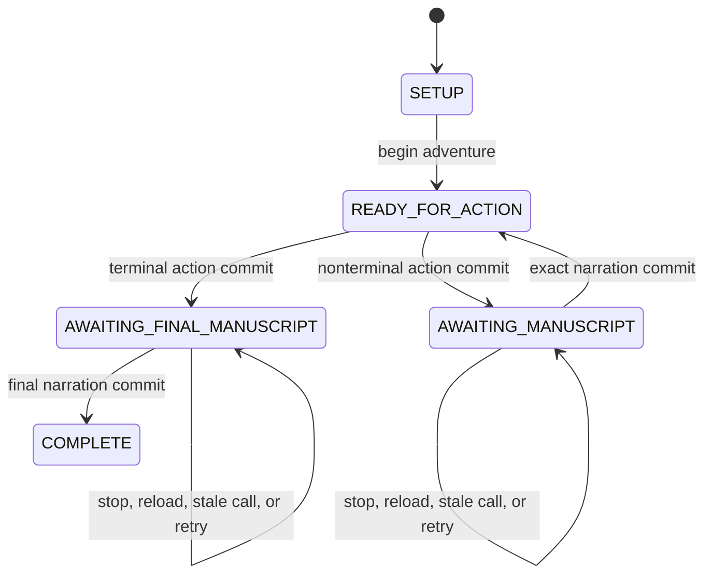

# Turn Recovery Protocol

## Invariant

At most one resolved turn may be waiting for prose. While it exists, no action,
ability, clock advance, damage, clue discovery, or ending transition may begin.
The only legal mutation is completing or replacing narration for that exact
resolution.



A terminal action commits directly to `AWAITING_FINAL_MANUSCRIPT`; it never
passes through two persisted pending states. Both pending phases use the same
resolution and recovery pipeline.

## Atomic action boundary

`perform_action` and every ability tool use one transaction:

1. Read the session and compare `expectedRevision`.
2. Return the old receipt if `operationId` already exists.
3. Reject unless phase is `READY_FOR_ACTION`.
4. Validate the target, approach, location, and ability prerequisites.
5. Roll once and derive effects from authored rules.
6. Write the new canonical state, operation ledger, complete `TurnResolution`,
   and pending phase in the same IndexedDB transaction.
7. Return the saved receipt, never an independently reconstructed result.

If interruption happens before step 6 commits, nothing happened. If it happens
after commit, the complete truth is recoverable even when ChatGPT never received
the return value.

## Resume contract

Every `get_adventure_state` response starts with the required next operation.
When narration is pending, it returns:

```ts
{
  phase: "AWAITING_MANUSCRIPT",
  requiredNextTool: "write_manuscript_entry",
  revision: 12,
  pendingResolution: {
    resolutionId: "res_...",
    roll: { die: 14, modifier: 2, total: 16, dc: 13 },
    canonicalEvents: [/* stable event IDs and display facts */],
    mustInclude: [/* factual constraints */],
    mustNotClaim: [/* contradictions to avoid */]
  }
}
```

Calling any action tool in this phase returns `NARRATION_REQUIRED` plus the same
payload. It does not merely return an error string that leaves the Agent to
guess what happened.

`write_manuscript_entry` requires the current revision and resolution ID. It
checks that all required event IDs are acknowledged, saves prose against that
resolution, clears `pendingResolution`, increments revision, and opens the next
phase. A duplicate operation ID returns the already-saved entry.

## Truth and prose

Canonical events are authoritative. Prose is attached to them but cannot write
back into mechanics. The page always renders the canonical roll and changes
next to the generated paragraph.

Before the phase advances, the same resolution may receive replacement prose
if the first narration attempt was rejected for length, missing event IDs, or
invalid plain text. After a valid entry commits, later prose editing is outside
v1 and cannot rewrite history.

## Required error responses

| Code                              | Meaning                                  | Agent recovery                                                                              |
| --------------------------------- | ---------------------------------------- | ------------------------------------------------------------------------------------------- |
| `NARRATION_REQUIRED`              | A resolved turn still needs prose        | Write the supplied pending resolution                                                       |
| `STALE_STATE`                     | Revision no longer matches               | Call `get_adventure_state` and obey `requiredNextTool`                                      |
| `DUPLICATE_OPERATION`             | Request already committed                | Use the returned original receipt                                                           |
| `ABILITY_LOCKED`                  | Artifact prerequisites are missing       | Continue with currently listed affordances                                                  |
| `ACTION_UNAVAILABLE`              | Target or approach is invalid now        | Rephrase using returned current affordances; no roll occurred                               |
| `CLIENT_CANCELLATION_UNAVAILABLE` | Informational compatibility status       | Continue only because all v1 mutations are reversible and device-local                      |
| `SAVE_CORRUPT`                    | Stored snapshot failed schema validation | Preserve the damaged record, offer explicit new-game recovery, and never overwrite silently |

## Acceptance sequence

The real-client gate is not passed until this exact scenario succeeds:

1. Agent reads revision 4 and performs an action with operation ID A.
2. Engine commits roll 9 and enters `AWAITING_MANUSCRIPT`.
3. ChatGPT is stopped before it writes prose.
4. The page is refreshed and a new ChatGPT turn reads state.
5. The Agent is forced to narrate resolution A; attempting action B returns the
   same pending receipt without a roll.
6. Narration A commits once, phase returns to `READY_FOR_ACTION`, and action B
   may then begin.
7. Retrying operation A at any later point never changes the state.
