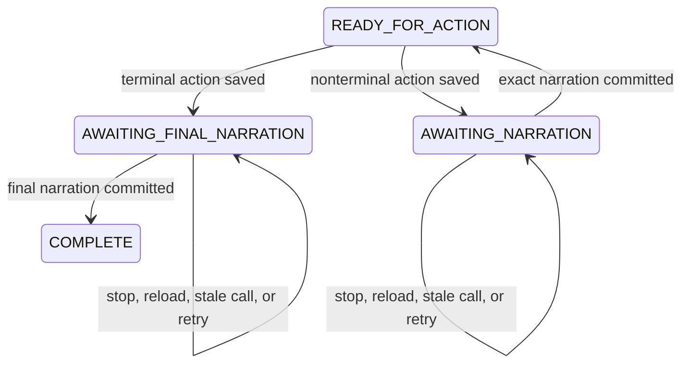

# Once Upon interruption and recovery protocol

The browser owns every canonical transition. The connected agent may stop at
any point and recover without rerolling or replacing a saved result.

## Recovery sequence

1. Call `get_story_state` after startup, reload, interruption, or a stale-state
   response.
2. Read `phase`, `revision`, and `requiredNextTool` from the returned state.
3. If narration is pending, call `commit_narration` with the exact revision,
   resolution ID, and every represented canonical event ID.
4. Only call `perform_action` while the phase is `READY_FOR_ACTION`.

Every mutating request carries a unique `operationId`. Retrying the same request
with the same ID returns its previous result. Reusing that ID for different
input is rejected.

## Error handling

| Code                  | Meaning                                          | Recovery                   |
| --------------------- | ------------------------------------------------ | -------------------------- |
| `NO_ACTIVE_SESSION`   | No story has started                             | Start the experience       |
| `STALE_STATE`         | Revision no longer matches                       | Read story state again     |
| `NARRATION_REQUIRED`  | Exact saved result still needs narration         | Commit that receipt        |
| `ACTION_UNAVAILABLE`  | Current phase or target rejects the action       | Follow current affordances |
| `ABILITY_LOCKED`      | Story ability is unavailable                     | Read current abilities     |
| `INVALID_INPUT`       | Receipt, event IDs, or payload failed validation | Correct the same request   |
| `OPERATION_ID_REUSED` | ID belongs to different input                    | Create a new operation ID  |

Persistence failures are surfaced without pretending a mutation succeeded.
Damaged version-2 saves may be quarantined under an experience-scoped corrupt
key before the player starts over.
