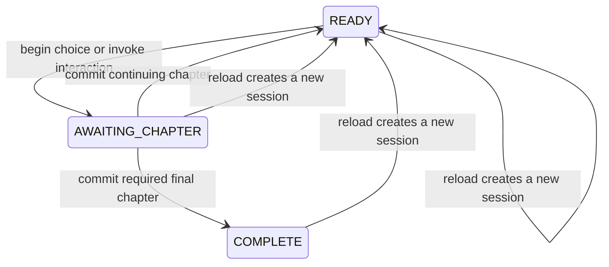

# Same-page turn protocol

The page owns canonical transitions only for the lifetime of the current
document. Reloading, closing the page, or choosing Start over creates a new
session at the prologue. Nothing attempts to restore a game save.

## Agent sequence

1. Call `get_story_state` before every player turn.
2. If `phase` is `AWAITING_CHAPTER`, commit the exact pending `turnId` before
   beginning anything else.
3. If the turn has an effect receipt, submit its exact `receiptId` and exact
   fact-ID set. Do not invoke the story-object tool again.
4. Obey `requiredChapterStatus`: Pencil and Memory must continue; the Last
   Manuscript must complete.
5. Use `allowedNextTools`, not mere registration presence, as authorization.

Every mutation carries the current `expectedSessionId`, `expectedRevision`, and
a unique `operationId`. Identical same-page retries are idempotent. Reusing an
operation ID for different input is rejected. A request from the previous page
fails with `STALE_SESSION`, even when its revision number matches.

An execution `AbortSignal` can stop a request while it waits in the controller
queue. After the last signal check, the engine transform is synchronous and is
the commit point; later cancellation cannot undo it.

| Code                  | Meaning                                       | Next action                         |
| --------------------- | --------------------------------------------- | ----------------------------------- |
| `STALE_SESSION`       | Request came from another page session        | Read the new state                  |
| `STALE_STATE`         | Revision changed                              | Read state again                    |
| `CHAPTER_REQUIRED`    | The same-page turn still needs prose          | Commit that exact turn              |
| `INTERACTION_LOCKED`  | Authored prerequisites are not met            | Continue the story                  |
| `INTERACTION_USED`    | One-shot interaction already changed the page | Use its pending or committed result |
| `ACTION_UNAVAILABLE`  | Phase or terminal status is invalid           | Follow the returned state           |
| `INVALID_INPUT`       | Shape, type, enum, ID, or receipt set failed  | Send the exact documented input     |
| `INVALID_DISCOVERY`   | Discovery is unavailable or unknown           | Remove it                           |
| `SEALED_FACT_LEAK`    | Prose revealed a protected truth too early    | Rewrite without the secret          |
| `OPERATION_ID_REUSED` | ID belongs to different input                 | Create a new ID                     |
